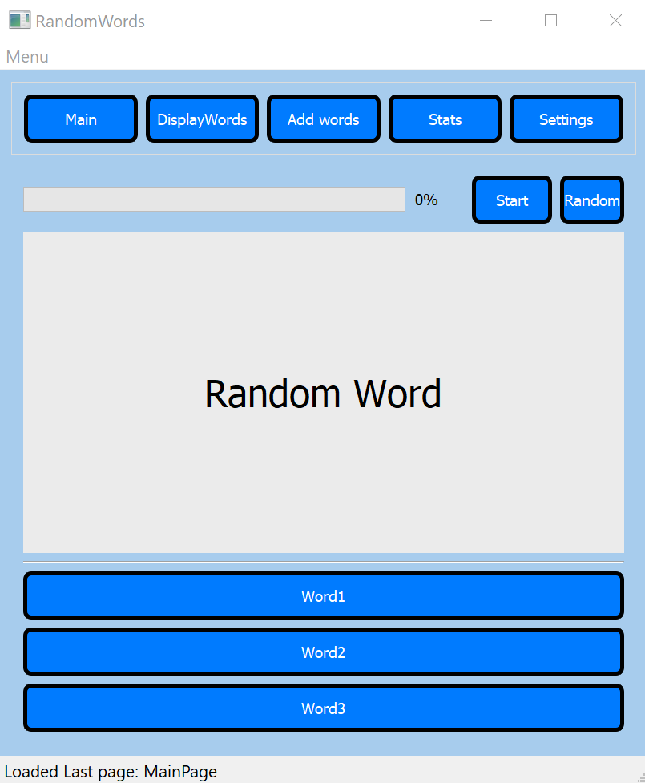

# PYQT5-Random-Words(OOP)

Hello, I am pleased to introduce you to a program with which you can practice English words with Polish translations. 
The program includes options such as

- tournament option
- word base with search option
- adding words both single and multiple (using a json)
- pronunciation of the actual word
- settings that are saved in the application

Preview of the program

It's second version of this Random Word application.
