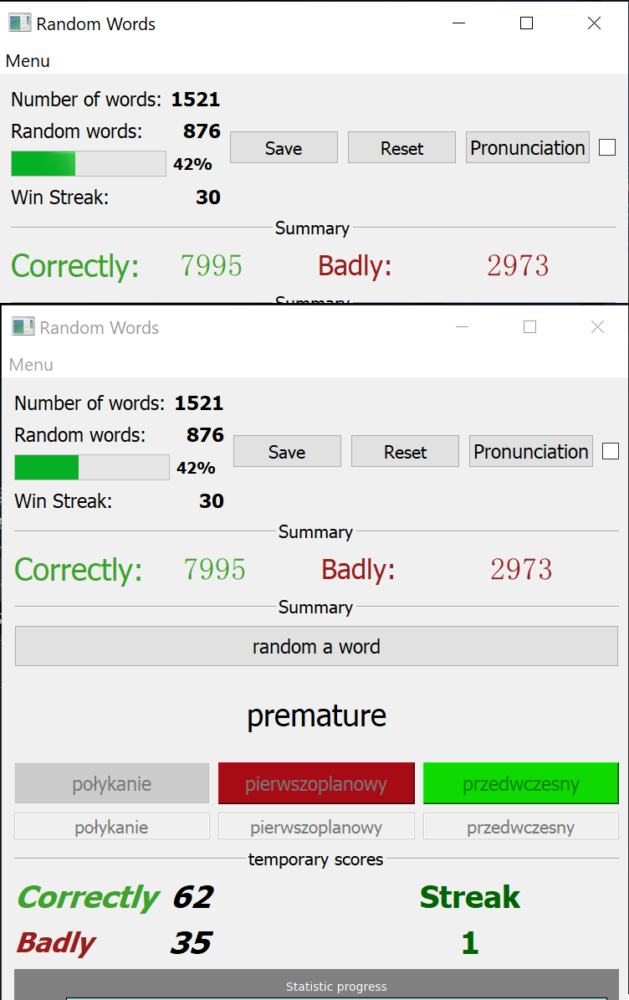
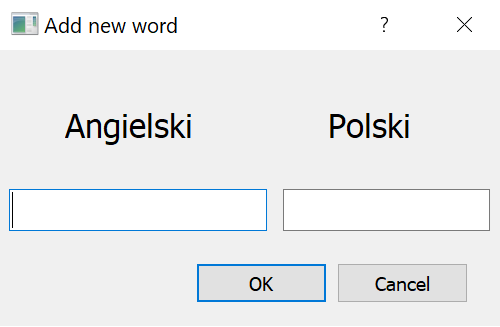

# PYQT5-Random-Words(OOP)
Hello, I am pleased to introduce you to a program with which you can practice English words with Polish translations. 
The program includes options such as
* main statistic about correct and bad answers
* this same as above with temporary scores with streak that inform us about win answers in a row.
* a feature that allows you to randomize words
* reset button that resets temporary stats
* the option of changing, the current translation of the word or its correction
* a pronunciation option that allows us to hear the correct pronunciation of a word
* "add new word" button which gives us option to add new word to our database
* save button that allows you to add temporary stats to the main ones and allows you to save all previously added words
* recently I added a new functionality, namely a graph that allows us to follow our previous actions jump up is a good answer, jump down is a wrong answer
* the pool of words from which words are currently drawn, after each good answer, a given word falls out of our pool and we will be able to answer it only on the next circulation, i.e. how we will answer each word correctly
* the program is made in such a way that the third time we answer the word correctly with 100% because otherwise the next word cannot be randomized, it is done for two reasons, the first to see the correct translation of the word, second, so that the case does not draw two words at the same time, which happened to me more than once when using this program.

To run this program you need libraries like: **pandas, pyttsx3, matplotlib, numpy, pyqt5**
which are mension in file `requirements.txt to` install libraries from file just type in terminal
`pip install -r requirements.txt`
 
The current version of the program looks like this 

Window that allows us to add a word

Icons used from fugue icon set by designer Yusuke Kamiyamane
